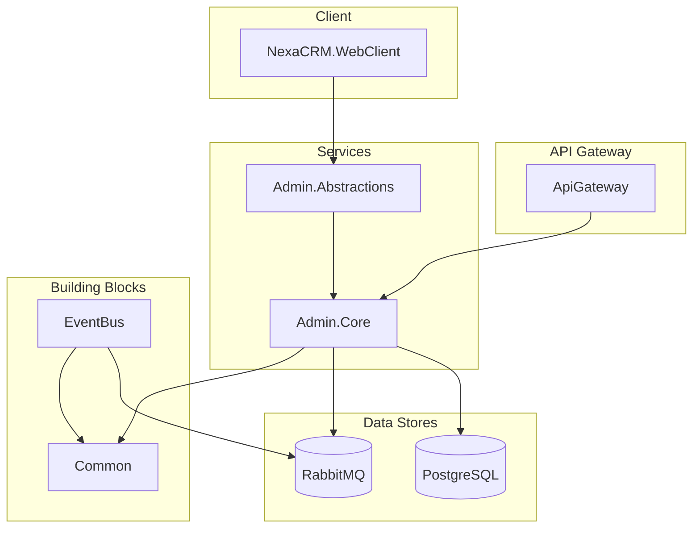

# -NexaCRM-
NexaCRM은 고객 관리부터 워크플로우 자동화, 보고서까지 한 번에 처리할 수 있는 종합 CRM 솔루션입니다. 반응형 UI와 메시지 브로커 기반 백엔드를 통해 유연한 확장과 안정적인 운영을 지원합니다.

👉 최신 main 브랜치 배포는 https://c1a16e15.nexacrm.pages.dev 에서 확인할 수 있으며, Merge 될 때마다 자동으로 갱신됩니다.

🗂️ 추후 예정된 Supabase 연동 및 서비스 고도화 계획은 [NexaCRM 고도화 및 기능 추가 로드맵](NexaCRM_Enhancement_Roadmap.md)에 정리되어 있습니다.
🧱 Supabase로 전환할 데이터 모델과 RLS 전략은 [Supabase DB 아키텍처 가이드](supabase/DB_ARCHITECTURE.md)에서 도메인별 테이블 구조와 운영 고려 사항으로 요약돼 있습니다.
📘 Supabase 프로젝트 준비, 패키지 설치, 단계별 체크리스트는 [Supabase 연동 가이드](supabase/SUPABASE_INTEGRATION_GUIDE.md)에서 확인할 수 있습니다.

📝 개요
NexaCRM은 고객 관리, 리드 관리, 영업 파이프라인, 워크플로우 자동화, 보고서 생성, 보안 인증을 모두 지원하는 올인원 CRM 플랫폼입니다.
C# Blazor 프론트엔드와 ASP.NET Core 마이크로서비스 백엔드를 이용해, 일관된 코드 베이스로 빠른 개발과 확장을 보장합니다.

🚀 주요 기능
📇 연락처 관리: 360° 고객 뷰 및 상호작용 타임라인

💼 리드 관리: 다채널 리드 스코어링 및 일괄 작업

🏷️ 영업 파이프라인: 칸반 보드, 드래그앤드롭 단계 관리

🤖 워크플로우 자동화: 트리거 기반 시나리오 디자이너

📊 보고서 & 분석: 차트·테이블 커스텀 리포트, PDF/CSV 내보내기

🔒 인증 및 보안: OAuth2.0, JWT, RBAC, OWASP Top 10 준수

📱 반응형 디자인: 데스크탑·태블릿·모바일 최적화

🏗️ 아키텍처


🛠️ 기술 스택
| 영역 | 기술 |
| --- | --- |
| **프론트엔드** | Blazor Web App, .NET 8 |
| **백엔드** | ASP.NET Core Web API, .NET 8 |
| **게이트웨이** | Ocelot |
| **데이터베이스** | PostgreSQL, Redis |
| **메시징** | RabbitMQ |
| **인증/보안** | Duende IdentityServer, JWT Bearer |
| **공유 로직** | .NET Standard |
| **테스트** | xUnit, Moq |

🏁 시작하기
### 필수 요소
- .NET SDK 8.0
- Docker & Docker Compose

### 클론 및 설정
```bash
git clone https://github.com/your-org/nexacrm.git
cd nexacrm
```

### 로컬 실행
> `dotnet` CLI를 사용하여 각 서비스를 실행하거나, Visual Studio/Rider에서 솔루션을 열어 실행할 수 있습니다.

#### 데이터베이스 & 메시지 브로커 실행
```bash
docker-compose up -d
```

#### 백엔드 서비스 실행
`Services.Admin.Abstractions` 프로젝트가 웹 클라이언트와 게이트웨이가 공유하는 도메인 계약(모델·인터페이스)을 제공하며, `Services.Admin.Core`는 해당 계약을 구현하는 서버 전용 구성요소입니다. WebAssembly 환경에서는 구현 라이브러리를 직접 참조하지 않아도 되므로 WASM0005 경고 없이 안전하게 도메인 모델을 활용할 수 있습니다. 게이트웨이나 웹 클라이언트를 실행하면 내부적으로 `Services.Admin.Core` 라이브러리를 통해 도메인 기능을 사용할 수 있습니다.
```bash
dotnet run --project src/NexaCRM.ApiGateway/NexaCrm.ApiGateway.csproj
```

#### 프론트엔드 실행
```bash
dotnet run --project src/Web/NexaCRM.WebClient/NexaCRM.WebClient.csproj
```

### 빌드/테스트 검증 스크립트
코드를 변경한 후에는 저장소 루트에서 다음 스크립트를 실행해 의존성 복원, 빌드, 테스트를 한 번에 검증할 수 있습니다.

```bash
./scripts/verify-build.sh
```

> `dotnet` SDK가 설치되어 있어야 하며, 스크립트는 자동으로 `dotnet restore`, `dotnet build --configuration Release`, `dotnet test --configuration Release`를 순서대로 수행합니다.

### 접속 정보
-   **Web UI**: `https://localhost:7001`

📁 폴더 구조
```
/NexaCRMSolution
|
|-- /src
|   |-- /NexaCRM.ApiGateway
|   |   `-- NexaCrm.ApiGateway.csproj
|   |
|   |-- /NexaCRM.BuildingBlocks
|   |   |-- /EventBus
|   |   |   `-- BuildingBlocks.EventBus.csproj
|   |   `-- /Common
|   |       `-- BuildingBlocks.Common.csproj
|   |
|   |-- /NexaCRM.Service
|   |   |-- /Admin.Abstractions
|   |   |   `-- Services.Admin.Abstractions.csproj
|   |   `-- /Admin.Core
|   |       `-- Services.Admin.Core.csproj
|   |
|   `-- /Web
|       `-- /NexaCRM.WebClient
|           `-- NexaCRM.WebClient.csproj
|
`-- NexaCrmSolution.sln
```
#### 모듈 책임 구분
- **Web/NexaCRM.WebClient**: Blazor WebAssembly UI. 도메인 계약만 참조하여 클라이언트 런타임에서 금지된 API 의존성을 제거했습니다.
- **Services/Admin.Abstractions**: Admin 도메인 모델과 서비스 인터페이스를 정의하는 공유 계층. WebAssembly와 서버가 동일한 타입을 활용합니다.
- **Services/Admin.Core**: Admin 도메인의 서버 구현. 백엔드 또는 서버 사이드 호스팅 환경에서만 로드되므로 보안 비즈니스 로직을 안전하게 캡슐화합니다.
- **BuildingBlocks/**: 옵션/이벤트 버스 등 전역 공통 유틸리티.
☁️ 배포
Docker 이미지 빌드

bash
docker build -t nexacrm-api src/CrmApi
레지스트리에 푸시

bash
docker push your-registry/nexacrm-api:latest
Kubernetes 적용

bash
kubectl apply -f k8s/
🤝 컨트리뷰션
포크(Fork)

기능 브랜치 생성(git checkout -b feature/your-feature)

커밋 & 푸시

풀 리퀘스트(PR) 생성

📄 라이선스
MIT © NexaCRM 팀
