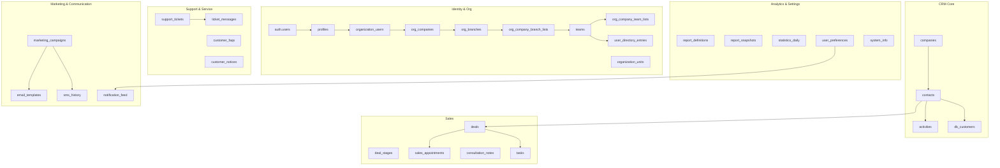

# NexaCRM Supabase DB 아키텍처 가이드

## 1. 설계 목표와 범위
- **Supabase PostgreSQL 일원화**: 현재 `schema.sql`에 정의된 기본 CRM 테이블(profiles, companies, contacts, deals, activities)을 출발점으로 삼아 모든 서비스 데이터를 Supabase 한 곳에 집약합니다.【F:supabase/migrations/schema.sql†L3-L138】
- **서비스 요구사항 전면 반영**: 연락처·딜·업무·지원·마케팅 등 각 서비스 인터페이스가 요구하는 데이터 구조를 모두 커버하도록 테이블과 관계를 설계합니다.【F:src/Web/NexaCRM.WebClient/Services/Interfaces/IContactService.cs†L6-L13】【F:src/Web/NexaCRM.WebClient/Services/Interfaces/ITaskService.cs†L6-L12】【F:src/Web/NexaCRM.WebClient/Services/Interfaces/ISupportTicketService.cs†L6-L13】【F:src/Web/NexaCRM.WebClient/Services/Interfaces/IMarketingCampaignService.cs†L6-L12】
- **역할 기반 보안과 다중 조직 지원**: 역할 확인과 접근 제어 요구사항을 만족하는 스키마와 Row Level Security 전략을 수립합니다.【F:src/Services/Admin.Abstractions/Interfaces/IRolePermissionService.cs†L5-L30】
- **실시간 협업과 자동화 대비**: 실시간 구독, 예약 작업, 자동화 트리거가 필요한 도메인(티켓, 업무, SMS, 알림 등)에 Supabase Functions, Realtime, Cron을 적용할 수 있도록 이벤트 컬럼과 상태 컬럼을 포함합니다.【F:src/Web/NexaCRM.WebClient/Services/Interfaces/ISupportTicketService.cs†L6-L13】【F:src/Services/Admin.Abstractions/Interfaces/ISmsService.cs†L9-L20】【F:src/Services/Admin.Abstractions/Interfaces/INotificationFeedService.cs†L7-L25】

## 2. 논리 도메인 개요

## 3. 도메인별 스키마 설계
### 3.1 인증 · 조직 관리
| 테이블 | 목적 | 주요 컬럼 | 연관 관계/비고 |
| --- | --- | --- | --- |
| `auth.users` | Supabase 기본 사용자 | id, email, metadata | 모든 사용자 기준 |
| `profiles` | 공개 프로필 | username, full_name, avatar_url | 기존 스키마 유지, `auth.users` FK.【F:supabase/migrations/schema.sql†L3-L26】 |
| `organization_units` | 조직 트리 관리 | id, tenant_id, parent_id, name | `OrganizationUnit` 모델 반영.【F:src/Services/Admin.Abstractions/Models/Organization/OrganizationModels.cs†L6-L28】 |
| `organization_users` | 조직 사용자 승인 흐름 | id, user_id, unit_id, role, status, approved_at, approval_memo | 사용자 승인·거절 로직 지원.【F:src/Services/Admin.Abstractions/Interfaces/IOrganizationService.cs†L9-L24】 |
| `user_roles` | 역할 매핑 | user_id, role_code, assigned_by | 역할 기반 권한 확인에 사용.【F:src/Services/Admin.Abstractions/Interfaces/IRolePermissionService.cs†L5-L30】 |
| `org_companies` | 테넌트별 내부 회사 마스터 | tenant_unit_id, code, name, contact, is_active | 관리자용 회사 기본 정보 저장.【F:supabase/migrations/schema.sql†L155-L171】 |
| `org_branches` | 회사 지점 관리 | company_id, tenant_unit_id, code, name, manager_id, is_active | 회사-지점 계층 구조 구성.【F:supabase/migrations/schema.sql†L173-L190】 |
| `org_company_branch_lists` | 회사별 지점 리스트 캐싱 | tenant_unit_id, company_id, branch_id, branch_code, branch_name, team_count, member_count | 회사 단위 지점 현황/요약 제공.【F:supabase/migrations/schema.sql†L192-L207】 |
| `teams` | 영업/지원 팀 정의 | tenant_unit_id, company_id, branch_id, code, name, manager_id, is_active | 팀이 소속된 회사/지점까지 추적.【F:supabase/migrations/schema.sql†L264-L277】 |
| `team_members` | 팀 구성원 | team_id, user_id, company_id, branch_id, role, allow_excel_upload, is_active | 사용자-팀-지점 관계 저장.【F:supabase/migrations/schema.sql†L279-L295】 |
| `org_company_team_lists` | 회사별 팀 리스트 | tenant_unit_id, company_id, branch_id, team_id, team_code, member_count, active_member_count | 회사/지점별 팀 현황 제공.【F:supabase/migrations/schema.sql†L297-L315】 |
| `user_directory_entries` | 사용자 조직 정보 | user_id, company_id, branch_id, team_id, tenant_unit_id, job_title, status | 관리자 입력 사용자 소속 데이터.【F:supabase/migrations/schema.sql†L317-L335】 |
| `agents` | 영업·지원 에이전트 프로필 | user_id, display_name, email, role | `Agent` 모델 연계, 자동 배정 기준.【F:src/Services/Admin.Abstractions/Models/Agent.cs†L3-L9】【F:src/Web/NexaCRM.WebClient/Services/Interfaces/IAgentService.cs†L7-L10】 |

Row Level Security(RLS)은 `tenant_id`(조직 ID)와 역할 정보를 조합해 조직 단위 격리를 보장합니다. 조직 관리자는 동일 테넌트 하위의 사용자·팀을 열람/수정하고, 전사 관리자는 모든 테넌트 접근 권한을 갖도록 정책을 작성합니다.

### 3.2 고객 및 데이터베이스(DB) 자산 관리
| 테이블 | 목적 | 주요 컬럼 | 연관 관계/비고 |
| --- | --- | --- | --- |
| `companies` | 고객사 정보 | name, website, phone, address, created_by | 기존 스키마 유지.【F:supabase/migrations/schema.sql†L29-L43】 |
| `contacts` | 개인 연락처 | first_name, last_name, email, phone, title, company_id, assigned_to | `Contact` 모델 매핑.【F:supabase/migrations/schema.sql†L45-L59】【F:src/Web/NexaCRM.WebClient/Models/Contact.cs†L3-L11】 |
| `contact_tags` | 태그 | contact_id, tag | 검색/필터링 용 |
| `contact_custom_fields` | 사용자 정의 필드 | contact_id, field_key, field_value | 관리자가 확장 필드 구성 |
| `activities` | 상호작용 로그 | type, notes, activity_date, contact_id, deal_id, user_id | 기존 스키마 + `Activity` 모델 지원.【F:supabase/migrations/schema.sql†L94-L105】【F:src/Web/NexaCRM.WebClient/Models/Activity.cs†L6-L14】 |
| `consultation_notes` | 상담 기록 | contact_id, title, content, priority, follow_up_date, user_id | `ConsultationNote` 모델 매핑, 영업 노트 관리.【F:src/Web/NexaCRM.WebClient/Models/ConsultationNote.cs†L5-L18】【F:src/Web/NexaCRM.WebClient/Services/Interfaces/ISalesManagementService.cs†L6-L24】 |
| `db_customers` | DB 배포 엔티티 | contact_id, customer_name, group, assigned_to, status, archive_flag, 확장 필드 | `DbCustomer`의 배정·아카이브 플로우 지원.【F:src/Services/Admin.Abstractions/Models/Db/DbCustomer.cs†L6-L55】【F:src/Services/Admin.Abstractions/Interfaces/IDbDataService.cs†L7-L33】 |
| `db_assignments` | 배포 이력 | db_customer_id, assigned_to, assigned_by, assigned_at, reassigned_at | 팀/개인 배포 추적 |
| `db_actions` | DB 작업 감사 | db_customer_id, action_type(assign/reassign/archive), actor_id, created_at | `IDbAdminService`의 삭제·내보내기 작업 로깅.【F:src/Services/Admin.Abstractions/Interfaces/IDbAdminService.cs†L7-L11】 |

DB 자산 영역은 `IDuplicateService`가 사용하는 중복 점수, 후보 목록을 저장하는 `duplicate_groups`, `duplicate_candidates`(아래 3.8 참조)와 연동됩니다.

### 3.3 영업 파이프라인 및 일정
| 테이블 | 목적 | 주요 컬럼 | 연관 관계/비고 |
| --- | --- | --- | --- |
| `deal_stages` | 파이프라인 단계 | name, sort_order | 기존 스키마 유지.【F:supabase/migrations/schema.sql†L64-L70】 |
| `deals` | 영업 기회 | name, value, stage_id, company_id, contact_id, assigned_to, expected_close_date | `Deal` 모델 구조 매핑.【F:supabase/migrations/schema.sql†L75-L88】【F:src/Web/NexaCRM.WebClient/Models/Deal.cs†L5-L15】 |
| `deal_members` | 협업 멤버 | deal_id, user_id, role | 공동 소유권/팀 판매 지원 |
| `deal_products` | 상품/매출 항목 | deal_id, product_name, quantity, unit_price | 향후 매출 세부 데이터 |
| `sales_appointments` | 일정 관리 | title, description, start_datetime, end_datetime, contact_id, user_id, type, status | `SalesAppointment` 및 충돌 감지 로직 대응.【F:src/Web/NexaCRM.WebClient/Models/SalesAppointment.cs†L5-L22】【F:src/Web/NexaCRM.WebClient/Services/Interfaces/ISalesManagementService.cs†L6-L18】 |
| `appointment_attendees` | 참석자 | appointment_id, contact_id/user_id, role | 외부/내부 참석자 분리 |
| `deal_checklists` | 단계별 체크 항목 | deal_id, stage_id, item, is_completed | 과정 관리 |
| `deal_documents` | 첨부 문서 | deal_id, storage_path, file_name, uploaded_by | Supabase Storage 연계 |

### 3.4 업무(Task) 및 협업
| 테이블 | 목적 | 주요 컬럼 | 연관 관계/비고 |
| --- | --- | --- | --- |
| `tasks` | 기본 업무 | title, description, due_date, priority, is_completed, assigned_to, created_by | `Task` 모델과 CRUD 인터페이스 대응.【F:src/Web/NexaCRM.WebClient/Models/Task.cs†L6-L15】【F:src/Web/NexaCRM.WebClient/Services/Interfaces/ITaskService.cs†L6-L12】 |
| `task_comments` | 커뮤니케이션 | task_id, user_id, comment, created_at | 업무 협업 |
| `task_reminders` | 리마인더 | task_id, reminder_at, channel | 알림 연동 |
| `task_watchers` | 구독자 | task_id, user_id | 변경 알림 |

### 3.5 지원 센터 & 고객 커뮤니케이션
| 테이블 | 목적 | 주요 컬럼 | 연관 관계/비고 |
| --- | --- | --- | --- |
| `support_tickets` | 티켓 본문 | subject, description, status, priority, customer_id, agent_id, category, created_at | `SupportTicket` 모델 대응.【F:src/Web/NexaCRM.WebClient/Models/SupportTicket.cs†L6-L16】【F:src/Web/NexaCRM.WebClient/Services/Interfaces/ISupportTicketService.cs†L6-L13】 |
| `ticket_messages` | 티켓 대화 | ticket_id, sender_id, body, attachments, created_at | 실시간 대화 추적 |
| `ticket_assignments` | 배정 이력 | ticket_id, agent_id, assigned_at, unassigned_at | 자동 배정/승계 |
| `ticket_sla_events` | SLA 측정 | ticket_id, event_type(opened/responded/resolved), occurred_at | SLA 리포트 |
| `ticket_tags` | 태그 | ticket_id, tag | 카테고리화 |
| `ticket_attachments` | 첨부 파일 | ticket_id, storage_path, file_name, content_type | Storage 연동 |
| `customer_notices` | 공지사항 | title, content, published_at, tenant_id | `Notice` 모델 매핑.【F:src/Services/Admin.Abstractions/Models/CustomerCenter/CustomerCenterModels.cs†L5-L20】【F:src/Services/Admin.Abstractions/Interfaces/INoticeService.cs†L7-L14】 |
| `customer_faqs` | FAQ | category, question, answer, display_order | `FaqItem` 구조 및 FAQ 서비스 대응.【F:src/Services/Admin.Abstractions/Models/CustomerCenter/CustomerCenterModels.cs†L7-L20】【F:src/Services/Admin.Abstractions/Interfaces/IFaqService.cs†L7-L12】 |

### 3.6 마케팅 & 커뮤니케이션 채널
| 테이블 | 목적 | 주요 컬럼 | 연관 관계/비고 |
| --- | --- | --- | --- |
| `marketing_campaigns` | 캠페인 메타 | name, type, status, start_date, end_date, budget, roi, owner_id | `MarketingCampaign` 모델 지원.【F:src/Web/NexaCRM.WebClient/Models/MarketingCampaign.cs†L6-L16】【F:src/Web/NexaCRM.WebClient/Services/Interfaces/IMarketingCampaignService.cs†L6-L12】 |
| `campaign_audiences` | 타겟 세그먼트 | campaign_id, audience_type(list/query), filter_json | 대상 관리 |
| `campaign_channels` | 채널 설정 | campaign_id, channel(email/sms/push), config_json | 다중 채널 |
| `campaign_metrics` | KPI | campaign_id, metric_date, impressions, clicks, conversions, spend | ROI 계산 |
| `email_templates` | 이메일 템플릿 | template_id, name, subject, created_by, updated_at | `EmailTemplate` 구조.【F:src/Web/NexaCRM.WebClient/Models/EmailTemplate.cs†L6-L17】【F:src/Web/NexaCRM.WebClient/Services/Interfaces/IEmailTemplateService.cs†L6-L10】 |
| `email_blocks` | 템플릿 블록 | template_id, block_order, block_type, content | 동적 레이아웃 |
| `sms_senders` | 발신번호 | number, label, is_default | 번호 관리 요구사항 대응.【F:src/Services/Admin.Abstractions/Interfaces/ISmsService.cs†L9-L20】 |
| `sms_history` | 발송 이력 | recipient, message, sent_at, status, sender_number, recipient_name | `SmsHistoryItem` 구조 대응.【F:src/Services/Admin.Abstractions/Models/Sms/SmsModels.cs†L6-L24】 |
| `sms_attachments` | SMS 첨부 | sms_history_id, file_name, file_size_bytes, content_type, storage_path | 첨부 관리 |
| `sms_schedules` | 예약 발송 | schedule_id, scheduled_at, payload_json, is_cancelled | 예약 기능 대응.【F:src/Services/Admin.Abstractions/Models/Sms/SmsModels.cs†L26-L29】【F:src/Services/Admin.Abstractions/Interfaces/ISmsService.cs†L9-L20】 |
| `sms_templates` | SMS 템플릿 | template_code, content | 재사용 템플릿.【F:src/Services/Admin.Abstractions/Models/Sms/SmsModels.cs†L26-L31】 |
| `notification_settings` | 채널 선호 | user_id, new_lead_created, deal_stage_changed 등 | `NotificationSettings` 모델과 저장/조회 서비스 매핑.【F:src/Services/Admin.Abstractions/Models/Settings/NotificationSettings.cs†L3-L13】【F:src/Services/Admin.Abstractions/Interfaces/INotificationService.cs†L6-L9】 |
| `notification_feed` | 인앱 피드 | id(UUID), user_id, title, message, type, is_read, timestamp_utc | `NotificationFeedItem` 구조 대응.【F:src/Services/Admin.Abstractions/Interfaces/INotificationFeedService.cs†L7-L25】 |
| `user_favorite_shortcuts` | 모바일 즐겨찾기 | user_id, shortcut_id, label, icon_css_class, target_uri, ordering | 사용자 즐겨찾기 서비스 대응.【F:src/Web/NexaCRM.WebClient/Models/Navigation/UserFavoriteShortcut.cs†L3-L28】【F:src/Web/NexaCRM.WebClient/Services/Interfaces/IUserFavoritesService.cs†L7-L15】 |

### 3.7 설정, 보안 및 시스템 정보
| 테이블 | 목적 | 주요 컬럼 | 연관 관계/비고 |
| --- | --- | --- | --- |
| `company_profile` | 기업 정보 | tenant_id, name, address, contact_number, branding_json | `CompanyInfo` 구조 대응.【F:src/Services/Admin.Abstractions/Models/Settings/SettingsModels.cs†L5-L11】【F:src/Services/Admin.Abstractions/Interfaces/ISettingsService.cs†L6-L15】 |
| `security_settings` | 보안 정책 | tenant_id, ip_restriction_enabled, login_block_enabled, whitelist, max_login_attempts, block_duration_minutes | `SecuritySettings` 기반.【F:src/Services/Admin.Abstractions/Models/Settings/SettingsModels.cs†L13-L20】【F:src/Services/Admin.Abstractions/Interfaces/ISecurityService.cs†L6-L9】 |
| `sms_settings` | SMS 자격증명 | tenant_id, provider_api_key, provider_api_secret, sender_id, templates_json | `SmsSettings` 필드 대응.【F:src/Services/Admin.Abstractions/Models/Settings/SettingsModels.cs†L22-L38】【F:src/Services/Admin.Abstractions/Interfaces/ISettingsService.cs†L6-L15】 |
| `user_profiles` | 사용자 상세 | user_id, full_name, email, phone_number, profile_picture | `UserProfile` 저장.【F:src/Services/Admin.Abstractions/Models/Settings/UserProfile.cs†L5-L15】 |
| `system_info` | 약관·고객센터 | tenant_id, terms, company_address, support_contacts | `SystemInfo` 모델 매핑 및 `ISystemInfoService` 대응.【F:src/Services/Admin.Abstractions/Models/SystemInfo/SystemInfoModels.cs†L3-L7】【F:src/Services/Admin.Abstractions/Interfaces/ISystemInfoService.cs†L6-L8】 |

### 3.8 데이터 품질 & 중복 관리
| 테이블 | 목적 | 주요 컬럼 | 연관 관계/비고 |
| --- | --- | --- | --- |
| `dedupe_configs` | 중복 탐지 설정 | tenant_id, enabled, days, include_fuzzy, score_threshold, weight_* 필드 | `IDedupeConfigService` 설정 항목 매핑.【F:src/Services/Admin.Abstractions/Interfaces/IDedupeConfigService.cs†L5-L36】 |
| `dedupe_runs` | 실행 이력 | id, tenant_id, started_at, finished_at, status, scanned_count | 배치 실행 관리 |
| `duplicate_groups` | 중복 그룹 | run_id, group_key, contact_display, count, score, latest_assigned, sample_name | `DuplicateGroup` 구조 대응.【F:src/Services/Admin.Abstractions/Interfaces/IDuplicateService.cs†L8-L33】 |
| `duplicate_candidates` | 후보 목록 | group_id, contact_id, customer_name, assigned_date | `DuplicateCandidate` 정보 저장.【F:src/Services/Admin.Abstractions/Interfaces/IDuplicateService.cs†L16-L33】 |
| `duplicate_actions` | 후속 처리 | group_id, action_type(archive/delete/merge), primary_contact_id, actor_id, executed_at | DB 운영 로그와 연계 |

### 3.9 리포트 · 분석 · 통계
| 테이블 | 목적 | 주요 컬럼 | 연관 관계/비고 |
| --- | --- | --- | --- |
| `report_definitions` | 사용자 정의 리포트 | user_id, name, selected_fields, filters_json | `ReportDefinition` 모델 및 저장 기능 대응.【F:src/Web/NexaCRM.WebClient/Models/ReportDefinition.cs†L5-L9】【F:src/Web/NexaCRM.WebClient/Services/Interfaces/IReportService.cs†L6-L15】 |
| `report_snapshots` | 생성된 리포트 캐시 | definition_id, generated_at, payload_json, format | 반복 사용 최적화 |
| `report_metrics` | 핵심 KPI | metric_code, metric_date, metric_value | 대시보드 공유 |
| `statistics_daily` | 로그인/다운로드 트렌드 | metric_date, total_members, total_logins, total_downloads, login_trend_json | `StatisticsResult`/`TrendPoint` 구조 대응 및 `IStatisticsService` 사용.【F:src/Services/Admin.Abstractions/Models/Statistics/StatisticsModels.cs†L5-L13】【F:src/Services/Admin.Abstractions/Interfaces/IStatisticsService.cs†L7-L8】 |
| `kpi_targets` | KPI 목표 | tenant_id, metric_code, target_value, valid_from, valid_to | 목표 대비 분석 |

### 3.10 감사 로그 · 통합 이벤트
| 테이블 | 목적 | 주요 컬럼 | 연관 관계/비고 |
| --- | --- | --- | --- |
| `audit_logs` | 시스템 감사 | id, actor_id, action, entity_type, entity_id, payload_json, created_at | 모든 주요 수정 작업 로깅 |
| `integration_events` | 외부 연동 이벤트 | id, event_type, payload_json, published_at, status | 메시지 브로커 연동 대비 |

## 4. 행 단위 보안(RLS) 전략
- **테넌트 격리**: 대부분의 비공개 테이블(`organization_units`, `contacts`, `deals`, `support_tickets` 등)에 `tenant_id` 컬럼을 추가하고 `auth.jwt() ->> 'tenant_id'`와 비교하는 RLS 정책을 적용합니다.
- **역할 기반 정책**: `user_roles` 또는 Supabase JWT의 role 클레임을 사용해 `IRolePermissionService`가 요구하는 권한 검사를 SQL 정책으로 구현합니다.【F:src/Services/Admin.Abstractions/Interfaces/IRolePermissionService.cs†L5-L30】
- **행 소유권**: 작성자 기반(`created_by`, `assigned_to`) 접근 제한을 추가해 사용자 개인 데이터(Task, Notification 등)를 보호합니다.
- **승인 흐름**: `organization_users.status`가 `approved`가 아닌 경우 대부분의 도메인 테이블에 접근하지 못하도록 정책을 분기합니다.【F:src/Services/Admin.Abstractions/Interfaces/IOrganizationService.cs†L9-L24】

## 5. 실시간 · 자동화 고려 사항
- **Realtime**: `support_tickets`, `ticket_messages`, `tasks`, `notification_feed`에 Supabase Realtime을 연결해 에이전트·사용자 화면을 즉시 갱신합니다.【F:src/Web/NexaCRM.WebClient/Services/Interfaces/ISupportTicketService.cs†L6-L13】【F:src/Web/NexaCRM.WebClient/Services/Interfaces/ITaskService.cs†L6-L12】【F:src/Services/Admin.Abstractions/Interfaces/INotificationFeedService.cs†L7-L25】
- **트리거**: `sms_schedules`는 Cron Function으로 예약 발송 후 상태 업데이트, `dedupe_runs`는 Background Worker 실행 후 결과 테이블을 채웁니다.【F:src/Services/Admin.Abstractions/Interfaces/ISmsService.cs†L9-L20】【F:src/Services/Admin.Abstractions/Interfaces/IDuplicateMonitorService.cs†L5-L10】
- **이벤트 소싱**: 주요 상태 변경(딜 단계 이동, 티켓 상태 변경 등)은 `audit_logs`와 `integration_events`에 기록해 외부 메시지 버스(RabbitMQ 등)와 연동합니다.

## 6. 마이그레이션 및 버전 관리
- 기존 `schema.sql`과 `rls.sql`을 버전 소스로 유지하면서, 위 도메인 테이블별 마이그레이션 파일을 생성해 단계적으로 확장합니다.【F:supabase/migrations/schema.sql†L3-L138】
- 각 서비스 전환 시, Mock 서비스가 기대하는 모델을 충족하는지 통합 테스트를 추가하여 데이터 계약을 보장합니다.【F:src/Web/NexaCRM.WebClient/Services/Interfaces/IContactService.cs†L6-L13】【F:src/Web/NexaCRM.WebClient/Services/Interfaces/IMarketingCampaignService.cs†L6-L12】
- Supabase `cron`과 `triggers` 정의는 별도 SQL 파일로 분리해 환경별 배포 시점을 제어합니다.

## 7. 운영 및 성능 고려 사항
- **인덱스**: 연락처 이메일, 딜 단계, 티켓 상태/우선순위, 예약 시간(sms_schedules.scheduled_at), 알림 unread flag 등에 인덱스를 생성해 조회 성능을 확보합니다.
- **아카이브**: `db_customers`·`support_tickets`·`audit_logs`에 파티셔닝(월 단위)을 적용하거나 아카이브 테이블로 이동하는 정책을 마련합니다.
- **Storage 연동**: 첨부 파일(tickets, deals, sms)은 Supabase Storage 버킷과 경로를 관리하는 메타 데이터를 테이블에 저장합니다.
- **메타데이터 캐싱**: 빈번히 조회되는 코드 테이블(딜 단계, 티켓 카테고리)은 Supabase Edge Function 또는 Redis 캐시로 가속할 수 있습니다.

## 8. 향후 확장 제안
- **고급 분석**: `statistics_daily`와 `report_snapshots`를 기반으로 Materialized View를 생성해 대시보드 응답 속도를 높입니다.【F:src/Services/Admin.Abstractions/Models/Statistics/StatisticsModels.cs†L5-L13】【F:src/Web/NexaCRM.WebClient/Services/Interfaces/IReportService.cs†L6-L15】
- **지능형 추천**: 중복 그룹과 상담 노트를 분석해 태그 추천, 후속 조치 자동화를 위한 ML 피드 테이블을 추가할 수 있습니다.【F:src/Services/Admin.Abstractions/Interfaces/IDuplicateService.cs†L8-L33】【F:src/Web/NexaCRM.WebClient/Models/ConsultationNote.cs†L5-L18】
- **옴니채널**: `campaign_channels`에 푸시/웹훅 채널을 확장하고, `integration_events`를 통해 외부 마케팅/커뮤니케이션 플랫폼과 연동합니다.
- **고객 여정 맵**: `activities`, `support_tickets`, `deals`, `tasks`를 조합한 고객 여정 Materialized View를 정의하여 360° 고객 뷰를 강화합니다.【F:supabase/migrations/schema.sql†L45-L105】【F:src/Web/NexaCRM.WebClient/Models/SupportTicket.cs†L6-L16】【F:src/Web/NexaCRM.WebClient/Models/Task.cs†L6-L15】

이 문서는 Supabase 마이그레이션과 서비스 구현 작업 시 참고하는 기준 문서로 활용하며, 각 서비스가 라이브 데이터로 전환될 때 실제 스키마와 정책을 지속적으로 업데이트해 일관성을 유지합니다.
