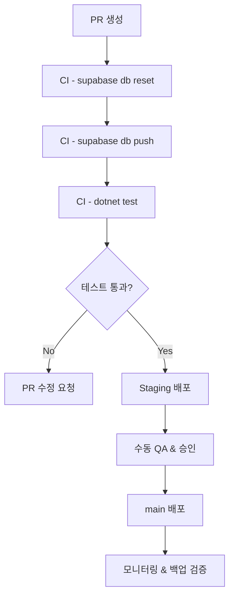

# Supabase DB 스키마 배포 전략

NexaCRM의 Supabase PostgreSQL 스키마를 안전하게 배포하기 위한 절차와 자동화 기준을 정의합니다. 이 전략은 `supabase/migrations`에 저장된 SQL 자산과 .NET 8 기반 서비스 계층이 기대하는 데이터 계약을 동시에 보호하는 것을 목표로 합니다.【F:supabase/migrations/schema.sql†L3-L138】【F:src/NexaCRM.Service/Abstractions/Interfaces/IRolePermissionService.cs†L1-L30】

## 1. 목표
- **신뢰성**: 모든 배포는 자동화된 검증을 거쳐 오류 없는 상태로 프로덕션에 반영합니다.
- **일관성**: Git 이력을 통해 스키마 변화 내역을 추적하고, 동일한 마이그레이션을 모든 환경(dev/staging/prod)에 적용합니다.
- **가역성**: 배포 실패 시 신속히 롤백하거나 이전 스냅샷으로 복원할 수 있도록 백업·롤백 전략을 내장합니다.【F:supabase/BACKUP_AND_RECOVERY.md†L1-L84】

## 2. 환경 & 브랜치 매핑

| Git 브랜치 | Supabase 프로젝트 | 목적 | 배포 빈도 |
| --- | --- | --- | --- |
| `feature/*` | 로컬 Supabase(개발자 개인) | 신규 기능 개발 및 초기 검증 | 필요 시 수시 |
| `develop` | 공유 Dev 인스턴스 | 통합 테스트, QA 사전 검증 | 최소 일 1회 |
| `release/*` | Staging 프로젝트 | UAT, 성능 검증, 데이터 마이그레이션 리허설 | 스프린트당 1~2회 |
| `main` | Production 프로젝트 | 고객 실사용 데이터 운영 | 배포 창구에 맞춰 주기적 |

> **미리보기 환경**: 주요 스키마 변경(PR)에는 `supabase db branch create`를 사용해 임시 프로젝트를 생성하고, PR 종료 시 제거합니다. 이를 통해 PR 리뷰어가 독립된 DB 상태에서 검증할 수 있습니다.

## 3. 마이그레이션 자산 구성
- `supabase/migrations/*.sql`: DDL, RLS, 시드 데이터를 버전별로 기록합니다. 신규 마이그레이션은 `supabase migration new <name>` 명령으로 생성합니다.【F:supabase/migrations/schema.sql†L3-L138】
- `supabase/functions/`: 트리거, Edge Function, Cron 스크립트 등 데이터베이스와 연동되는 함수 정의를 포함합니다.
- `supabase/DB_ARCHITECTURE.md`: 도메인 테이블 구조 참조 문서로, 변경 사항은 항상 본 전략 문서와 함께 업데이트합니다.【F:supabase/DB_ARCHITECTURE.md†L1-L184】
- `supabase/BACKUP_AND_RECOVERY.md`: 정기 백업 및 복구 절차를 정의하므로, 가역성 섹션에서 언급하는 스냅샷 시점과 연결됩니다.【F:supabase/BACKUP_AND_RECOVERY.md†L1-L84】

## 4. 스키마 변경 수명주기

1. **설계**
   - 기능 요구사항과 서비스 계층 인터페이스 변경사항을 수집합니다.【F:src/NexaCRM.UI/Services/Interfaces/IContactService.cs†L1-L13】
   - `DB_ARCHITECTURE.md`에 도메인 설계를 반영하고 리뷰어와 구조를 확정합니다.
2. **로컬 개발**
   - 로컬 Supabase 인스턴스에서 `supabase db reset`으로 최신 상태를 확보한 후, SQL 변경을 실험합니다.
   - 새로운 마이그레이션 파일을 추가하고 `supabase db lint`로 기본 정적 분석을 수행합니다.
3. **CI 검증 (Pull Request)**
   - PR 생성 시 GitHub Actions(또는 동등한 CI)에서 다음 명령을 수행합니다:
     ```bash
     supabase db reset --db-url $SUPABASE_DEV_DB_URL
     supabase db push --db-url $SUPABASE_DEV_DB_URL
     dotnet test ./tests/BlazorWebApp.Tests --configuration Release
     ```
   - `db push`가 실패하면 빌드는 즉시 중단하며, 실패 로그를 PR에 첨부합니다.
4. **미리보기 배포 (선택)**
   - 데이터 파급도가 큰 변경(PR)에는 `supabase db branch`로 임시 프로젝트를 생성하고, QA가 실제 앱을 연결해 검증합니다.
5. **Staging 배포**
   - `release/*` 브랜치 병합 시 CI가 Staging 프로젝트에 `supabase db push --include "functions,policies"`를 실행합니다.
   - Staging에서 smoke test 및 롤백 리허설(백업/복원)을 진행합니다.
6. **Production 배포**
   - Staging 승인 후 `main`에 머지하며, Git 태그(예: `db-vYYYYMMDD`)를 생성합니다.
   - 배포 자동화가 `supabase db push --dry-run`으로 미리 검증한 뒤 실제 배포를 수행합니다.
   - 배포 직후 애플리케이션 헬스 체크 및 주요 테이블 샘플 조회를 실행합니다.

## 5. 검증 및 품질 게이트
- **SQL 정적 분석**: `supabase db lint` 결과가 경고 수준을 초과하면 배포 차단.
- **스키마 일치 테스트**: C# Entity/DTO와 DB 스키마가 일치하는지 `dotnet test`에서 통합 테스트(예: `SchemaContractTests`)로 검증합니다. 테스트 프로젝트는 `tests/BlazorWebApp.Tests` 경로에 유지합니다.【F:docs/AGENTS.md†L8-L23】
- **데이터 마이그레이션 테스트**: `supabase db diff --linked` 결과를 통해 의도치 않은 드리프트를 감시하고, Diff 결과는 PR에 아티팩트로 첨부합니다.
- **퍼포먼스 회귀**: 주요 테이블에 대한 `EXPLAIN ANALYZE` 스크립트를 Staging에서 실행하고 10% 이상 성능 저하 시 변경을 재검토합니다.

## 6. 자동화 파이프라인 개요



## 7. 롤백 & 복구 전략
- **사전 스냅샷**: Production 배포 직전 `supabase db dump --data-only`로 전체 데이터 스냅샷을 생성하고, S3 버킷에 버전 태깅하여 저장합니다.
- **다운타임 없는 롤백**: 스키마 변경이 비파괴적일 경우 `supabase db rollback <migration_timestamp>`을 활용해 이전 마이그레이션으로 되돌립니다.
- **재해 복구**: `BACKUP_AND_RECOVERY.md`에 정의된 PITR(시간 지정 복구) 시나리오를 활용하고, RPO/RTO는 각각 5분/15분으로 설정합니다.【F:supabase/BACKUP_AND_RECOVERY.md†L20-L84】
- **검증 시나리오**: 롤백 후 `dotnet test`에서 핵심 시나리오(로그인, 딜 생성, 티켓 등록)가 정상 동작하는지 확인합니다.

## 8. 커뮤니케이션 & 승인 흐름
- 스키마 변경은 최소 2명 이상의 리뷰어(데이터베이스 담당, 서비스 담당)가 승인합니다.
- 배포 24시간 전 변경 요약을 운영 채널에 공유하고, 의존 서비스 팀에 영향 범위를 명시합니다.
- 배포 후 1시간 동안 실시간 모니터링 룸을 운영하며, 문제 발생 시 롤백 담당자를 즉시 호출할 수 있는 연락 체계를 유지합니다.

## 9. 향후 개선 과제
- Supabase `change applier` 또는 데이터 카탈로그 도구와 연동해 자동으로 마이그레이션 문서화를 생성합니다.
- `supabase/functions` 테스트를 CI에 편입하고, DB 스키마 변경과 함수 배포를 단일 파이프라인에서 관리합니다.
- 대규모 마이그레이션 시 트래픽 셰이핑을 위해 읽기 전용 복제본을 활용하는 전략을 검토합니다.

이 전략 문서는 스키마 변경 시 필수 참조 자료로 유지하며, 운영 중 발견되는 요구사항(성능, 보안, 감사 요구)을 반영해 지속적으로 업데이트합니다.

## 10. 실행 준비 사항 & 지원 범위

전략을 실제로 수행하기 위해서는 아래 준비 항목을 선제적으로 충족해야 합니다. 항목별로 체크리스트를 완료한 뒤 배포 절차를 시작하세요.

### 10.1 인프라 & 접근 권한
- **Supabase CLI 1.153 이상**: 모든 환경에서 동일한 버전을 사용하도록 개발/CI 런너에 설치합니다.
- **프로젝트 서비스 롤 토큰**: `SUPABASE_DB_URL`, `SUPABASE_ACCESS_TOKEN` 환경 변수를 `dev/staging/prod`별로 분리해 저장하고, CI 비밀 값으로 주입합니다.
- **S3 또는 Object Storage 버킷**: `BACKUP_AND_RECOVERY.md`에 정의된 백업 파일을 업로드할 버킷과 접근 키를 준비합니다.【F:supabase/BACKUP_AND_RECOVERY.md†L6-L60】
- **감사 로그 보관소**: 배포 로그와 SQL 실행 기록을 보관할 로깅 시스템(예: CloudWatch, Elastic)을 지정합니다.

### 10.2 코드 & 데이터 일관성 준비
- **마이그레이션 폴더 동기화**: `supabase/migrations`가 최신 상태인지 확인하고, 누락된 수동 변경이 없도록 `supabase db diff` 결과를 검토합니다.【F:supabase/migrations/schema.sql†L3-L138】
- **.NET DTO/Entity 업데이트**: 스키마 변경과 연계된 C# 모델을 `src/` 및 `tests/`에서 동기화하고 컴파일이 통과하는지 점검합니다.【F:docs/AGENTS.md†L8-L23】
- **테스트 보강**: `SchemaContractTests`와 같이 스키마-코드 일치성을 보장하는 테스트 케이스를 최신 상태로 유지합니다.
- **시드 데이터 검토**: 환경별 초기 데이터가 필요한 경우 `supabase/seed` 스크립트를 준비하고, 민감 데이터가 포함되지 않도록 마스킹 규칙을 적용합니다.

### 10.3 파이프라인 구성
- **CI Job 정의**: `supabase db reset` → `supabase db push` → `dotnet test` 순으로 실행되는 워크플로 파일을 구성하고, 실패 시 즉시 중단하도록 설정합니다.
- **권한 분리**: Staging/Production 배포 Job은 승인을 받은 유지 관리자만 수동으로 트리거할 수 있도록 GitHub Environments 또는 동등한 기능을 사용합니다.
- **알림 연동**: 배포 성공/실패 이벤트를 Slack, Teams 등 운영 채널에 게시하도록 Webhook을 구성합니다.

### 10.4 운영 팀 준비
- **롤백 리허설 일정**: 분기마다 최소 1회 `supabase db rollback` 또는 PITR 시뮬레이션을 수행하고 결과를 기록합니다.
- **모니터링 대시보드**: 배포 후 확인할 주요 KPI(에러율, 쿼리 응답 시간)를 사전에 정의하고 시각화 대시보드를 공유합니다.
- **커뮤니케이션 플랜**: 배포 창구, 승인자, 비상 연락처 목록을 최신 상태로 유지하며, 변경 시 운영 공지 채널에 즉시 반영합니다.

### 10.5 내가 도울 수 있는 부분
- **마이그레이션 설계 지원**: 테이블/인덱스 설계 초안을 작성하거나, Supabase SQL 예시를 최신 문법으로 제공해 드립니다.
- **CI 스크립트 작성**: GitHub Actions 혹은 Azure Pipelines용 YAML 샘플을 .NET 8 기준으로 생성하고, 컴파일 검증용 `dotnet` 명령을 포함하도록 도와드립니다.
- **검증 자동화**: 스키마-코드 일치 여부를 확인하는 단위/통합 테스트 케이스 예시를 제공하고, 필요한 경우 테스트 프로젝트 구조를 제안합니다.
- **운영 체크리스트 정리**: 배포 전후 점검 리스트를 Markdown 문서로 정리해 팀 내 공유를 도와드립니다.
- **문서화 유지보수**: 본 문서나 관련 MD 파일의 구조 개선, 번역, 요약 등을 함께 수행할 수 있습니다.
